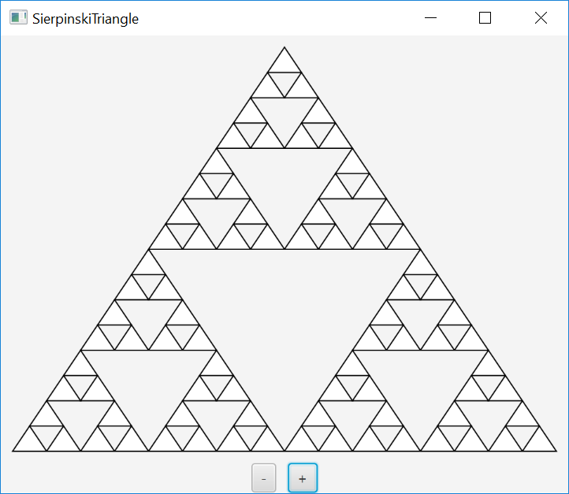

# Data Structures & Algorithms

### Exercises

1. [Exercise 18.01 (BigInteger Factorial)](exercises/Exercise18_01.java)
2. [Exercise 18.19 (Sierpinski Triangle)](exercises/Exercise18_19.java)
  

### Fiddles

1. [Recursive Tree (Fractal)](fiddles/RecursiveTree.java)
  
